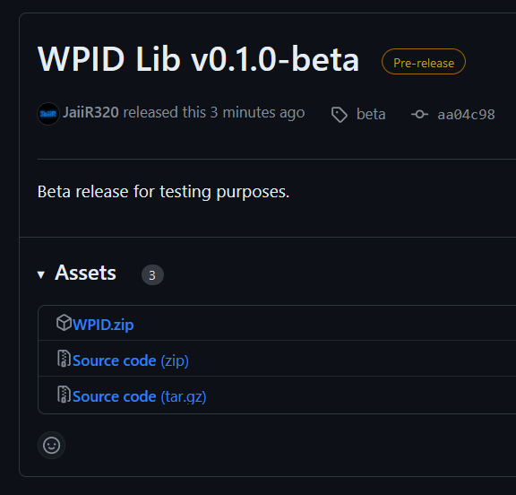
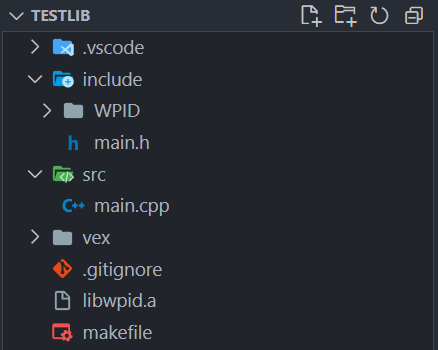

# Libraries and VEXCode

Implementing a library into your VEXCode project is quite easy and only requires a few basic steps. For a static library such as WPID, all you really need to do is add the header files into your project, add the library archive file and add the location of the archive file to your mkenv.mk file and you are up and running.

> Note: if you attempt to import another library, make sure the archive file was compiled for the V5 brain, otherwise it will not work.

Here is a step by step process for specifically importing WPID into your project.

## Adding the WPID Library
The first step is to add the necessary files to your project. Go to the [WPID library release page](https://github.com/AustinRebello/WPID-Library/releases/).



Download the zip and take note of its location. Now navigate to your project directory. If you are in VSCode, right click the empty space in your project directory and click "Reveal in File Explorer" to open the project in your file explorer.

Open or extract the zip you just downloaded, and add the WPID folder to the include folder of your project. Then add the libwpid.a file to your project folder.
Your project should look something like this:



You can see the WPID folder inside the include folder, and the libwpid.a file in your project directory.

In the vex folder, open mkenv.mk and scroll down to line 105. Now just add "libwpid.a" to the line.

```makefile
# libraries
LIBS = --start-group libwpid.a -lv5rt -lstdc++ -lc -lm -lgcc --end-group
```

## Using the Library
Now that you have added all the files you can start using the library. This involves including the header files that you need to use, or you could just include "wpid.h" in your files to access the entire library. This will be explained more in the other tutorials.

If you ever need a quick reference to the library, you can look at the .h files to find all the function prototypes and classes. The .a archive file is essentially a minified version of the source code, and gets compiled alongside your program.

---
## Creating your own Library
> *For advanced users*

If you ever wanted to create and share your own library, its just as easy. All you need to do is make sure you have all necessary .h and .cpp files associated with your project, compile an archive, and share the headers and archive files with whoever you want!

### Compiling an Archive
To compile, first make sure that any unnecessary files are deleted or moved outside of your project. This includes and extra .h files and .cpp files (especially main.cpp). It should only consist of the source code for your library, along with all of the respective header files.

You might also have to point to the source files in the makefile if you have many layers of folders in src.
```makefile
# inside "makefile"
# location of the project source cpp and c files
SRC_C  = $(wildcard src/*.cpp)
SRC_C += $(wildcard src/*.c)
SRC_C += $(wildcard src/*/*.cpp)
SRC_C += $(wildcard src/*/*.c)
SRC_C += $(wildcard src/*/*/*.cpp)
SRC_C += $(wildcard src/*/*/*.c)
```
Editing this chunk of code in your makefile will give the compiler access to any nested source files inside folders. This wasn't necessary to do for the header files, but if you run into that issue I would advise doing something similar.

Now you need to actually change the command that is run when you build the project. Further down the makefile file, change the build target to build an archive instead of a binary.
```makefile
# build targets
all: $(BUILD)/$(PROJECTLIB).a
# all: $(BUILD)/$(PROJECT).bin
```
As you can see from the image above, the build target is a .a file now. I advise keeping the other line just incase you want to build a binary for the robot instead of an archive file.

Now when you hit the build button, instead of building a program for the brain, it builds an archive file located in your build folder. Use this archive file, along with the header files to share the library just as we did!
