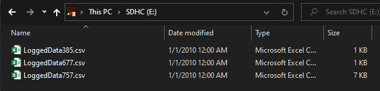

# Logging Data on the Brain and in the Terminal

Seeing what PID values are being used is critical for tuning the robot and getting the cleanest and fasted autonomous route possible. That is why logging these values either to the terminal, or to a file for graphing is important as it grants the ability to visualize the change in these parameters over the course of a full run of the robot.


Here is a step by step process to log all the necessary parameters onto the computer terminal or VEX Brain.

## LOG() Terminal Logging

Much of the logging in the terminal is done for you, with many LOG() calls, such as the one below, informing you of data or warning for errors.

```c++
LOG(INFO) << " err: " << error << " spd: " << speed << " P: " << error*kp << " I: " << integral*ki << " D: " << derivative*kd;
```
> This LOG statement outputs the current PID, Error and Speed values for the VEX Robot.

### The Different Log Levels

There are three LOG() levels, WARN, INFO and DEBUG in that order. Selecting DEBUG will also include the INFO and WARN descriptions, while selecting INFO will also include the WARN descriptions.

#### WARN
The WARN log level indicates that something the program was not expecting has occurred, such as a problem or a process that was disturbed in an unexpected way. The WARN log level does not mean that the program failed during runtime, and the code should still be running after a WARN was used.

#### INFO
This is considered the 'standard' log level indicating that an event occurred, the application transferred to another state, etc. Information that is logged using the INFO log level should be one hundred percent informative and ignoring the info logs regularly should not result in important information getting missed.

#### DEBUG
The DEBUG level is used for information that may be needed during the troubleshooting process, diagnosing issues or running the library in a test mode to ensure the library is running correctly.


### How to Use This in the Code

To access and use the built in library terminal logger, please include the wpid.h file or the logger.h file to the file you wish to use the Logging function from.
Once that is done, you can call the logging function using the format below:
```c++
LOG(LOGLEVEL) << data << optionalData << moreOptionalData;
```
where LOGLEVEL is either WARN, INFO or DEBUG and any/all data.
Not adding any data to be logged out will just result in the log level and timestamp being output.
Adding multiple variables or strings to the data will result in all data being logged on one line as one string.

---
## Logging to the Brain and Graphing the Results
The P, I, D, Error and Speed values for ***EACH*** motor group are also automatically logged to a set of files if you have a microSD card inserted in the VEX Brain.

> #### IMPORTANT NOTE: Since VEX does not contain the libraries necessary for deleting files, you will *HAVE* to delete files between each individual run, or they will accumulate and no longer be graphable.

### How to Graph the Data
You will first want to remove the microSD card from the VEX Brain and plug it into a computer.
Once you navigate to the SD Card in File Explorer, you should see a list of files, with the number of files equaling the number of instructions per motor group.
So if you have 2 motor groups and 3 driving instructions, but also 1 mechanism and 2 mechanism instructions, you will see 8 total files for that one run.



You are then going to want to select all of these files and copy them to the file path WPID-Library/python_resources/VexLogs
> Note: If this folder does not exist, right click and add a new folder called "VexLogs," the python script will not find the files if the folder is not named VexLogs
> Note: Make sure to store or remove any old files already existing in this file path. 


Once you place the log files in the VexLogs folder, you are ready to run the python file!

> Note: If the python file is throwing errors regarding not finding pandas, numpy, etc; you may need to install those packages. To install those packages, simply type "pip install (package name)" and it will pull the package down to your python installation. Listed below are all the packages that graphData.py uses:

```python
import pandas as pd
import numpy as np
import matplotlib.pyplot as plt
import os
import sys
```

To run the Python file, open a command line interface (command prompt) and navigate to the python_resources folder. Once there, just type "py graphData.py" to graph the files.


What this is going to do is compile all the files into a single data frame in python, then splitting the data in the data frame by motor group. For the following example, there will be a "LEFT" "CENTER" and "RIGHT" motor group. 

The program will generate a new window for each motor group, with the next window can only be viewed after closing the first one. Here is an example of the "CENTER" motor group, used for HDrive, graphed out for a single instruction.


Lastly, you can edit what parameters of PID you are viewing in the graph, as graphing all of them may cause one or more parameters to be hard to read. To accomplish this, you can include the parameters of PID you ***DO*** want to see as command line arguments, for example:


Will yield:


Not including any parameters is okay, the program will default to include all 3 parameters when none are specified.

> ### REMINDER: PLEASE REMEMBER TO WIPE ALL FILES FROM THE SD CARD AFTER EVERY SINGLE VEX ROBOT RUN AND REPLACE OLD FILES IN VEXLOGS FOLDER