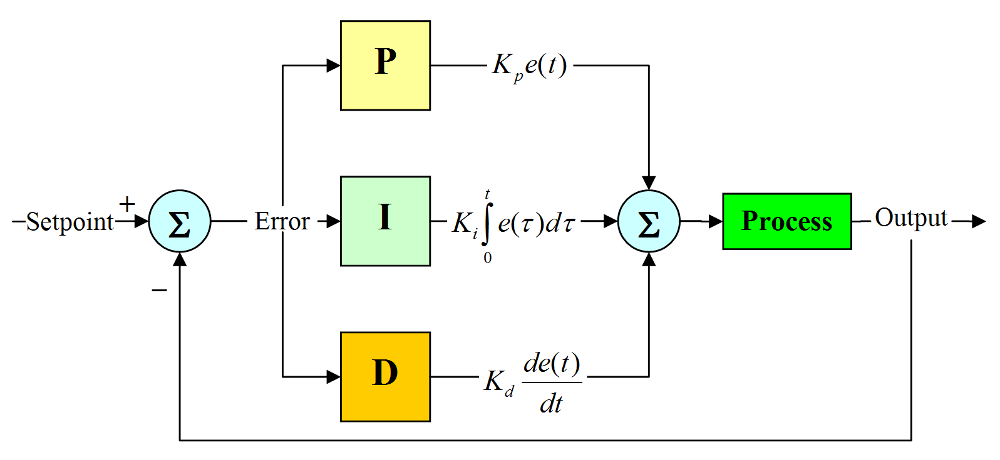

# PID Implementation

Our PID implementation in the WPID library uses a basic Proportional-Integral-Derivative (PID) algorithm structure with some add-on utilities and tuning features that allow for more efficient motion. This tutorial covers the basics of PID and the WPID-specific implementation of the algorithm.

# What is PID?

Proportional Integral Derivative (PID) Control is the most common method of control used in industry applications. PID is preferred professionally because the algorithm has the ability to adapt to different environments and allows for generally straightforward implementation.

# Open-loop and Closed-loop Control

When considering types of motion algorithms, the options for implementation follow one of two general approaches: open-loop or closed-loop control. In open-loop control, the algorithm takes in a set of input parameters and uses the values of these fields to compute a response. During the execution of the algorithm, no new internal or external data is introduced into the calculations. This approach allows for efficient and cost-effective implementation of an algorithm. However, this control method is not able to react to changing environments.

In closed-loop control, the algorithm takes input from the initial set of parameters and factors the system output into its calculations. These systems are typically more complex than open-loop systems, as the hardware must include a component for the collection of internal or external information. Different types of sensors can be used for the collection of external output; the type of information collected varies depending on the application. Closed-loop systems are typically more expensive due to the need for sensing components, but algorithms using this approach are more precise and accurate than open-loop control systems.

# PID VEX Applications

PID control is a type of closed-loop control system. In the VEX setting, the algorithm takes in a target distance parameter as its set-point or goal state. The system output comes from a sensor on the robot that determines the robot’s current distance from its set-point. This sensor can be an external camera, ultrasonic range finder, line tracker, or encoder (internal or external). In th WPID implementation, the chosen sensor for system output is the internal encoder system on the VEX V5 motors. The encoder sensor responds to motion and returns the distance that the motor has traveled. This traveled-distance is subtracted from the set-point-distance to determine the steady-state error, referred to as error in the figure below. Then, the P, I, and D constants combine with the steady-state error to calculate the speed of the robot and the loop repeats with the new encoder output.


> Figure of PID closed-loop control

---
# How Do P, I, and D Constants Work?

The PID controller operates using a combination of three constants: the proportional constant Kp, the integral constant Ki, and the derivative constant Kd. 

The Kp constant proportionally increases the robot’s response-speed based on steady-state error. With a higher steady-state error, the Kp constant will yield a more immediate response, however; a high Kp can cause overshoot, where the robot hits its set-point and then continues moving.

```cpp
float error;
//error*kp;
```
> Proportional element of PID control

The Ki constant multiplies with the summation of steady-state error to move the robot incrementally towards its set-point. Ki adds more precision to the system, so that once Kp brings the robot close to its set-point, the Ki integration can cover the remaining distance. The combination of Kp and Ki is used in the PI control configuration of PID to quickly (Kp) and precisely (Ki) reach a set-point.

```cpp
float integral = prev_integral + (error * (delay_time/(float)1000));
//integral*ki;
```
> Integral element of PID control

The Kd constant multiplies with the difference of steady-state error to decrease overshoot. The combination of Kp and Kd is used in the PD control configuration of PID to quickly (Kp) reach a set-point while curbing overshoot (Kd). 

```cpp
float derivative = (error - prev_error) / (delay_time/(float)1000);
//derivative*kd;
```
> Derivative element of PID control

Using all three constants in conjunction implements the PID configuration, where the robot can quickly (Kp) and precisely (Ki) reach a set-point while curbing overshoot (Kd). The Ki and Kd constants are not used together in a configuration, as the immediate response of Kp is crucial for an efficient implementation.

```cpp
float speed = error*kp + integral*ki + derivative*kd;
```
> PID control implementation in PID.cpp

---
# Why Does PID Need Additional Utilities?

While PID serves as an adaptable and efficient algorithm for robotic motion, the algorithm has several blind spots that can be addressed with supplemental utilities. The first implementation issue with PID occurs at the intersection of the Kp and Ki constants. When continuously integrating with Ki throughout a PID-controlled motion, the integral portion of the algorithm increases to the point where overshoot is difficult to avoid. In order to eliminate overshoot from PID motions, this continuous accumulation of steady-state error needs to be limited to specific periods of the motion.

The integral clamping and max integral limit features within the WPID library address the overshoot issue by limiting the window during which integral can accumulate. Integral clamping ensures that integral does not accumulate if it would cause the mechanism to move at a speed that is higher than the input parameter `max_speed`. Max integral keeps the integral at or below a specified target value. Integral clamping is a passive utility that is active during every PID motion while max integral is a tuning feature that allows for further customization of the integral behavior. Max integral is described in more detail in the next section of the tutorial.

```cpp
float integral = prev_integral + (error * (delay_time/(float)1000));
if(integral*ki > max_integral_speed) {integral = max_integral_speed/ki;}
if(integral*ki < -max_integral_speed) {integral = (-max_integral_speed)/ki;}

if(abs(speed) > abs(max_speed) && std::signbit(error) == std::signbit(speed)){
    speed -= integral*ki;
    integral = prev_integral;
    speed += integral*ki;
}
prev_integral = integral;
```
> Integral clamping and limiting in PID.cpp

Another issue with PID is the lack of a filtration feature for derivative noise. The derivative portion of PID is subject to sharp fluctuations during motion that make this piece of the algorithm difficult to implement smoothly.

The low-pass derivative filtration feature within the WPID library addresses the fluctuation in derivative by weighting each new derivative reading lower than the summed total of previous readings (previous_estimate). The weighting factor is determined by the value of `a`, where `a > 0.5` in order to preserve the influence of the previous_estimate. The weight of the newest derivative reading `(error - prev_error)` is adjusted by a factor of `(1-a)`. The weight of the combined total of previous readings is adjusted by a factor of a. Thus, readings that are significantly far from the average derivative reading have less of a drastic impact on the derivative element of PID, resulting in an overall smoother trend for derivative behavior.

```cpp
float a = .7;
if(prev_error == MAXFLOAT) {prev_error = error;}
float current_estimate = (previous_estimate*a + (1-a)*(error - prev_error)); 
previous_estimate = current_estimate;
prev_error = error;
float derivative = current_estimate / (delay_time/(float)1000);
```
> Derivative filtration in PID.cpp

---
# How to Use the PID Class in a WPID Project

Setting up the PID control for a VEX project using the WPID library involves two steps. First, you have to call the PID constructor and initialize the Kp, Ki, and Kd values. Below is some sample code showing the creation of a PID object.

```cpp
//PID(float kp, float ki, float kd)
PID liftPID = new PID(0.7, 0.01, 0.5);
```
> PID constructor call example

Next you need to call the applicable setters to initialize PID tuning features. These setters initialize the error range, settling speed threshold, maximum speed the integral calculation can contribute to the final speed, and the elapsed time for system timeouts.

- `void setErrorRange(int degrees);`
- `void setLowSpeedThreshold(int threshold);`
- `void setMaxIntegral(int max_integral);`
- `void setTimeout(int timeout);`

> PID feature setters

### Error Range

The error range value determines the number of V5 motor degrees +/- away from the target that are acceptable as the final error. In an example case, the `liftPID` error range is initialized to 5 degrees. If the motor needs to travel 180 degrees, the motor may end its motion after traveling anywhere in the range of {175-185} degrees. The final error after this motion will be anywhere between {-5-5} degrees. The error range default value is 2 degrees.

```cpp
liftPID.setErrorRange(5);
```
> Error range setter call

Setting an error range is important when considering the settling time of a PID motion. A lower error range will cause each PID motion to take longer to complete, but also allows for a higher degree of position accuracy. A higher error range will shorten the settling time at the cost of position accuracy.

### Low Speed Threshold

The low speed threshold value determines the highest speed that the mechanism may have at the *end* of a motion. When enabled, this feature blocks the mechanism from exiting the PID loop until its position is within the error range AND its current speed is less than the low speed threshold value. In an example case, the `liftPID` low speed threshold value is set to 7. If the motor needs to travel 180 degrees, the motion will not be finished until the error is between {-5-5} degrees AND the motor speed is under 7. Even if the motor is within the error range, the motor will continue to move until its speed reads below 7. The default low speed threshold value is -1; this feature is disabled in the PID calculations until it is set.

```cpp
liftPID.setLowSpeedThreshold(7);
```
> Low speed threshold setter call

Setting a low speed threshold also influences the settling time of PID motion. Setting the low speed threshold closer to 0 will increase the settling time while smoothing out the deceleration of the mechanism. Setting the low speed threshold to a higher value will decrease the settling time but also risks a more abrupt transition to the stopping state. Leaving this feature disabled will cause the mechanism to immediately stop once it has hit the error range, which can induce 'choppy' motion. Without a low speed threshold, the different motor_groups in a chassis (left, right, center, etc.) may also stop at slightly different times, leading to overshoot on only one side (or motor_group). This behavior is possible because of thread desynchronization, but is dampened with the introduction of a properly-tuned low speed threshold.

### Max Integral

The max integral value determines the maximum allowed value for the integral portion of the PID calculations. During a PID-controlled motion, the current integral calculation is lowered to the max integral value if it exceeds the set limit. In an example case, the `liftPID` max integral value is set to 15. If the motor needs to travel 180 degrees, the `integral*ki` value will be limited to a range of {-15-15}. The default max integral value is set to the top speed of the V5 motors (100), meaning that the integral portion of PID remains unbounded until this value is changed.

```cpp
liftPID.setMaxIntegral(15);
```
> Max integral setter call

The max integral tuning feature is useful in curbing overshoot during PID motion. Because the integral portion of PID is calculated using the sum of errors, high errors can lead to a disproportionally large integral contribution to the final speed calculation, especially with a high Ki constant. Together with the integral clamping utility, max integral limits this build-up of integral in order to allow high Ki constants to be used without as much risk of overshoot. Disabling this feature limits your ability to use higher Ki constants if you do not want system overshoot.

### Timeout

The timeout value determines the amount of time that passes before the system stops running PID. In an example case, the `liftPID` timeout is set to 3000ms. If the motor needs to travel 180 degrees but has taken longer than 3 seconds to run, the PID will stop running regardless of the error or speed at the 3 second mark. The default timeout value is -1; timeouts will be automatically disabled unless manually set.

```cpp
liftPID.setTimeout(3000);
```
> Timeout setter call

A timeout is useful as a hard limit that acts as a backup stopping criteria if a PID motion is taking too long. However, it is important to note that a timeout will override all other PID tuning features in order to stop the motion. Because it has the potential to disrupt the PID algorithm, a timeout should only be implemented in the last step of the tuning process. The timeout value should be employed as an external failsafe.

---
# What PID Constant and Tuning Feature Values Are Best?

The best PID constant (Kp, Ki, Kd) and tuning feature values vary from application to application, but a basic guide for where to start with PID tuning can be found in the PID tuning tutorial.